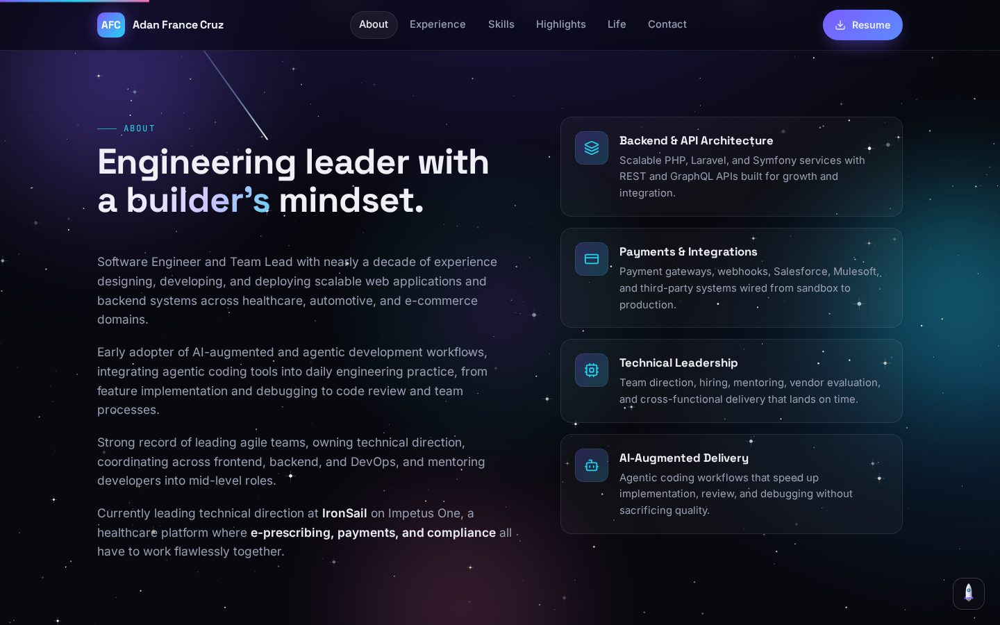
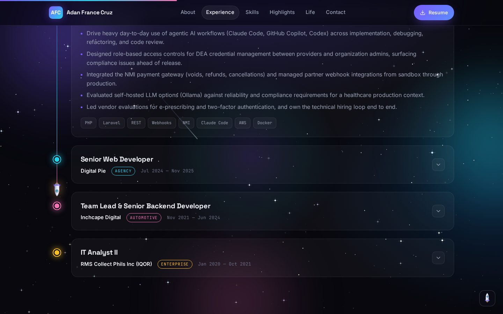
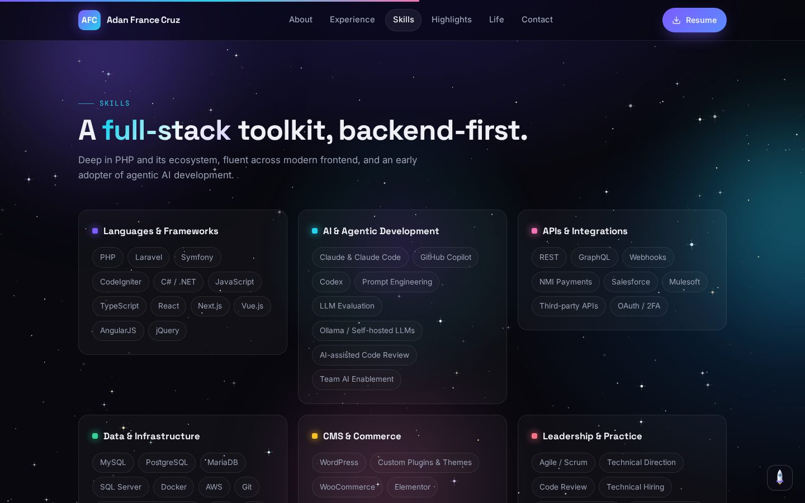
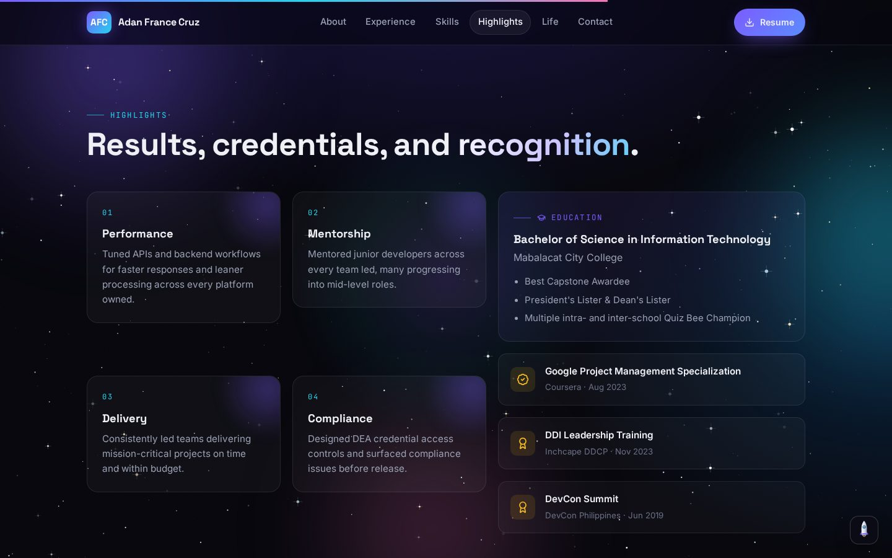
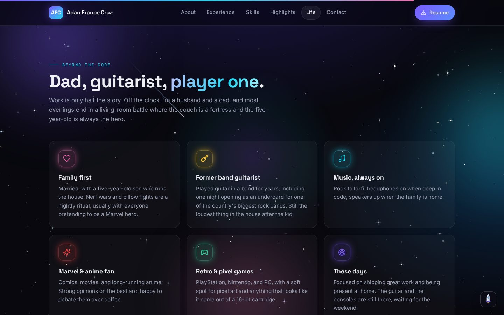
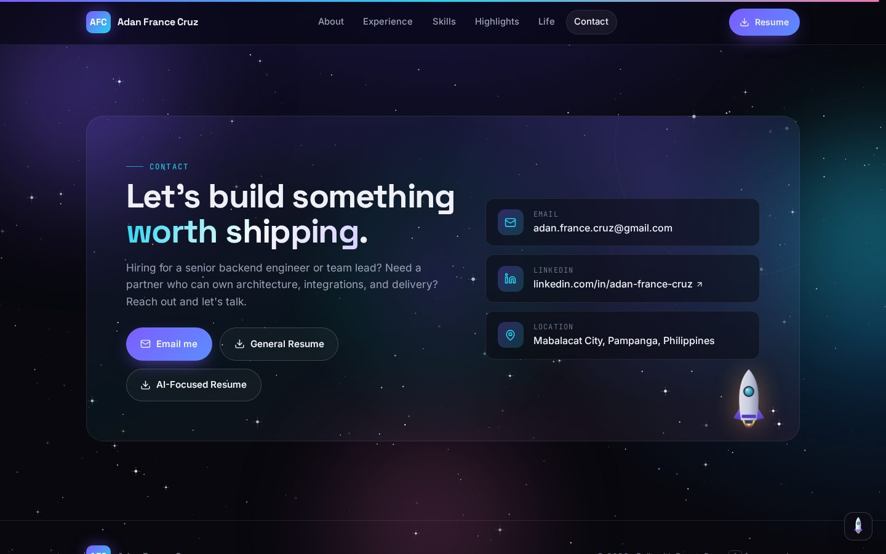

<div align="center">

# Adan France Cruz — Portfolio

**Software Engineer · Team Lead · AI‑Augmented Development**

A space‑themed, interactive portfolio built with React, TypeScript, and Framer Motion.

[](https://francecruz017.github.io/portfolio/)
[](https://linkedin.com/in/adan-france-cruz)


<br/>

[](https://francecruz017.github.io/portfolio/)

</div>

<br/>

## What's inside

| | |
|---|---|
| **Living hero** | Interactive particle constellation that reacts to the cursor, a rocket that crosses the sky, a ringed planet and a cratered moon, a typewriter cycling through roles, and a floating PHP class that describes the author. |
| **Starfield backdrop** | Canvas‑drawn twinkling stars with shooting stars, drifting nebula orbs, and six parallax planets scattered down the page. |
| **Experience timeline** | Expandable, colour‑coded cards for every role, with a rocket that travels down the timeline as you scroll. |
| **Skill constellations** | Six skill groups on 3D tilt cards with a mouse‑tracking glow, plus a scrolling tech marquee. |
| **Terminal easter egg** | Press <kbd>`</kbd> anywhere to open a working shell: `whoami`, `experience ironsail`, `skills`, `hire`, `resume ai`, plus a few hidden commands. |
| **Beyond the code** | A personal section: dad, former band guitarist, Marvel and anime fan, retro gamer. |
| **Responsive & accessible** | Mobile navigation, reduced‑motion support, keyboard‑navigable terminal, downloadable resumes. |

<br/>

## Screens

<table>
  <tr>
    <td width="50%"></td>
    <td width="50%"></td>
  </tr>
  <tr>
    <td><b>About & services</b> — summary, count‑up stats, and four pillars of what I deliver.</td>
    <td><b>Experience</b> — nine years across healthcare, automotive, and e‑commerce.</td>
  </tr>
  <tr>
    <td></td>
    <td></td>
  </tr>
  <tr>
    <td><b>Skills</b> — backend‑first toolkit, fluent across modern frontend and agentic AI workflows.</td>
    <td><b>Highlights</b> — achievements, education, and certifications.</td>
  </tr>
  <tr>
    <td></td>
    <td></td>
  </tr>
  <tr>
    <td><b>Beyond the code</b> — the human side, and how I work.</td>
    <td><b>Contact</b> — email, LinkedIn, and both resumes one click away.</td>
  </tr>
</table>

<br/>

<div align="center">

### The terminal

Every answer is generated from the same data file that powers the page, so the shell never drifts from the resume.


<br/><br/>


</div>

<br/>

## Built with

- **React 18 + TypeScript** for the UI, with a single typed data file as the source of truth for every section and the terminal.
- **Vite 6** for the toolchain and a relative base path so the build works at any URL.
- **Framer Motion** for scroll‑linked reveals, the timeline rocket, layout‑animated navigation, and the terminal transitions.
- **Canvas API** for the particle network, starfield, and shooting stars, hand‑written with no chart or particle libraries.
- **Lucide** icons, **Space Grotesk / Inter / JetBrains Mono** type.
- **GitHub Actions → GitHub Pages** for continuous deployment on every push to `main`.

## Run it locally

```bash
git clone https://github.com/francecruz017/portfolio.git
cd portfolio
npm install
npm run dev
```

Then open http://localhost:5173. `npm run build` produces the static site in `dist/`.

## Project layout

```
src/
  data.ts                 all portfolio content in one typed file
  App.tsx                 page composition, launch button, terminal shortcut
  components/
    Hero.tsx              headline, typewriter, code card, rocket flyby
    Sections.tsx          stats, about, experience, skills, highlights, life, contact
    Space.tsx             starfield, planets, rocket, timeline rocket
    Effects.tsx           particles, cursor glow, reveal, tilt, magnetic buttons
    Terminal.tsx          the easter‑egg shell
    Nav.tsx               sticky nav with active‑section pill and mobile menu
  styles.css              design tokens and all styling
public/resume/            downloadable PDFs
.github/workflows/        Pages deployment
```

---

<div align="center">
<sub>Designed and built by Adan France Cruz · <a href="https://francecruz017.github.io/portfolio/">francecruz017.github.io/portfolio</a></sub>
</div>
