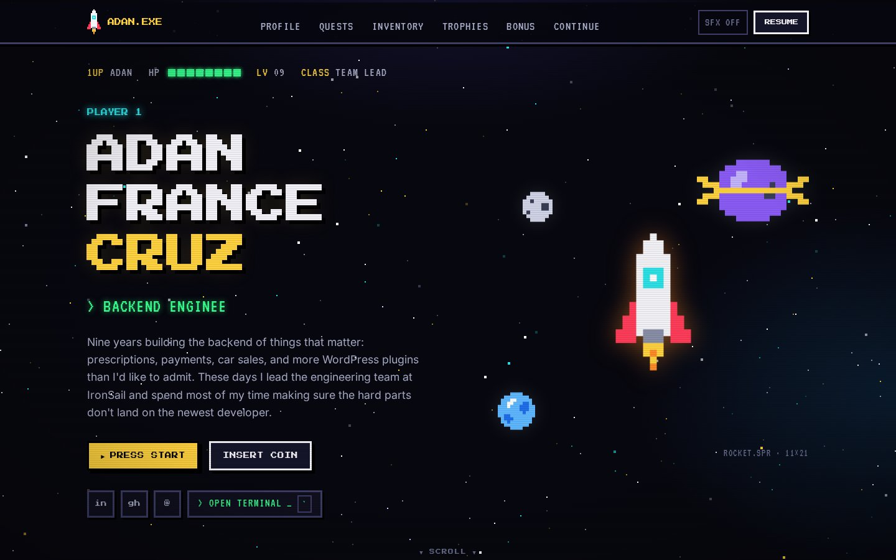
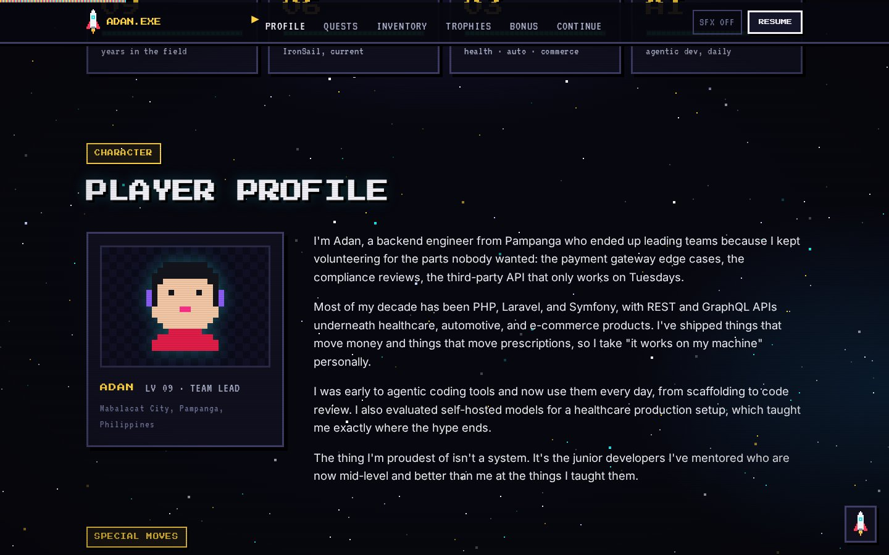
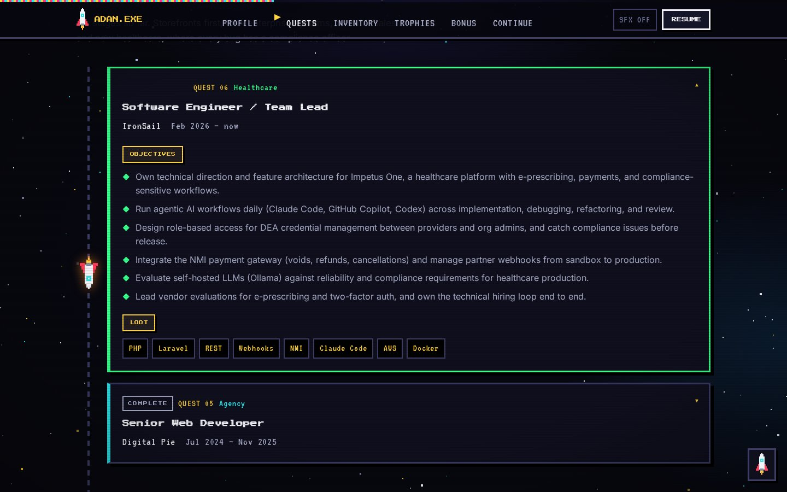
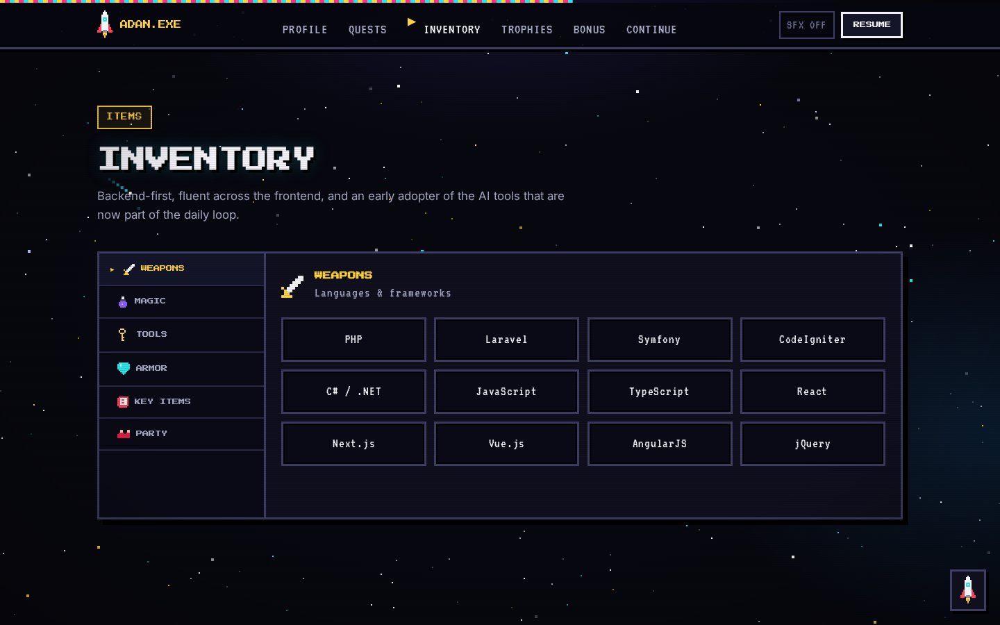
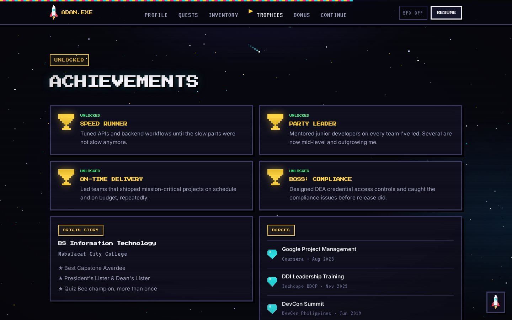
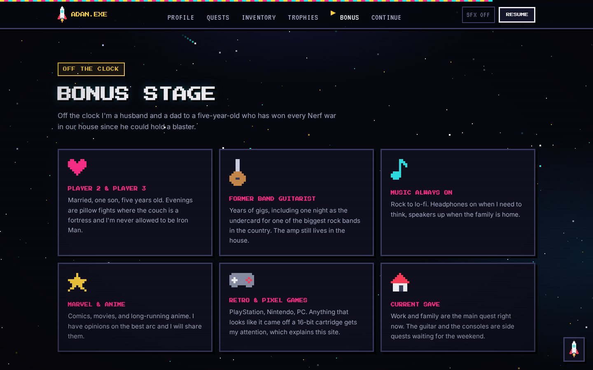
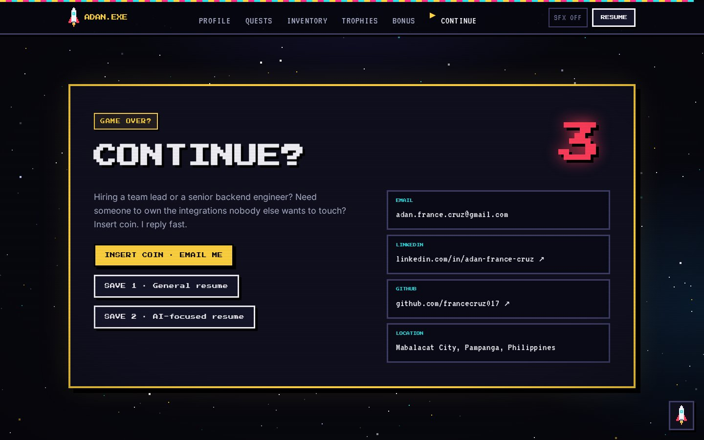
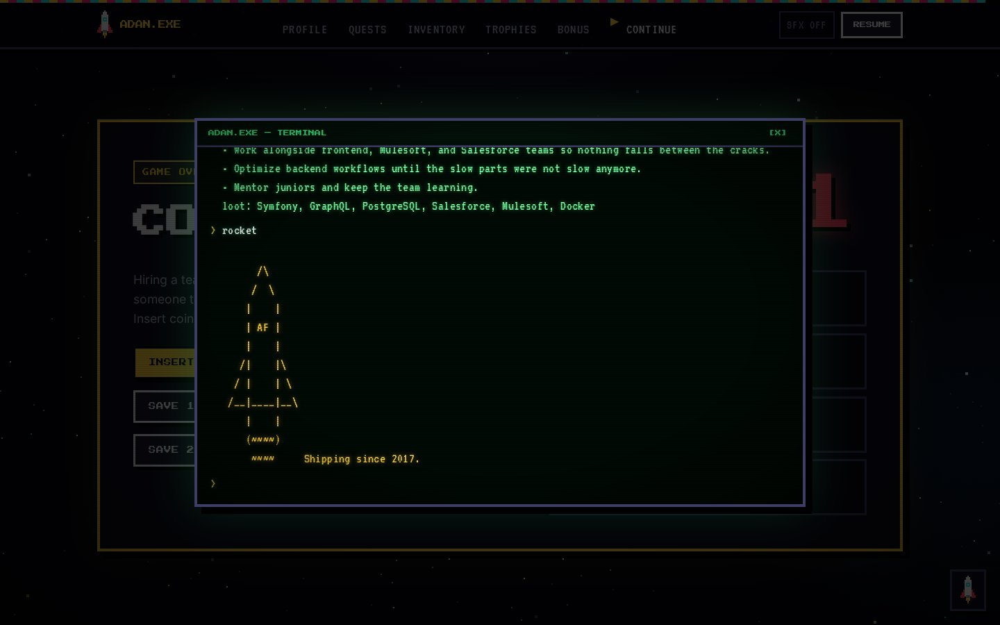
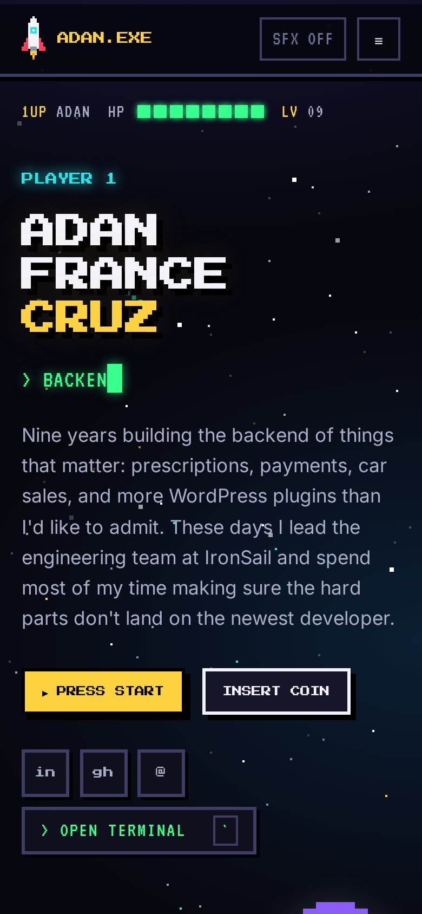

<div align="center">

# ADAN.EXE

**Adan France Cruz · Backend Engineer · Team Lead**

A retro arcade portfolio. Pixel sprites, a quest log, an inventory screen, a CRT terminal, and chiptune sound effects, all built by hand in React.

[](https://francecruz017.github.io/portfolio/)
[](https://linkedin.com/in/adan-france-cruz)


<br/>

[](https://francecruz017.github.io/portfolio/)

</div>

<br/>

## The idea

Most developer portfolios look the same. This one is a game cartridge. Every section is a screen you would find in a 16‑bit RPG, and every piece of content is the real thing: nine years of backend work across healthcare, automotive, and e‑commerce, written in first person.

| Screen | What it is |
|---|---|
| **Title screen** | HUD with 1UP, HP, and level. Hand‑drawn pixel rocket with an animated flame, three pixel planets, and a typewriter that cycles through roles. |
| **Player profile** | Pixel avatar on a checkered character card, the story in my own words, and four "special moves". |
| **Quest log** | Every role as a quest, with status stamps, objectives, and loot. A pixel ship travels down the dashed path as you scroll. |
| **Inventory** | Skills as an RPG menu. Tabs for WEAPONS, MAGIC, TOOLS, ARMOR, KEY ITEMS, and PARTY, each with item slots. |
| **Achievements** | Unlocked trophies, an origin story, and badges. |
| **Bonus stage** | Off the clock: family, guitar, music, Marvel, retro games. |
| **Continue?** | A looping countdown, an INSERT COIN button that emails me, and two save files (the resumes). |
| **Terminal** | Press <kbd>`</kbd> for a green‑phosphor CRT shell with `whoami`, `quests inchcape`, `inventory`, `hire`, and a few hidden commands. |

Sound effects are synthesized with the Web Audio API and off by default. Flip `SFX` in the nav to hear blips, coin drops, and a rocket launch.

<br/>

## Screens

<table>
  <tr>
    <td width="50%"></td>
    <td width="50%"></td>
  </tr>
  <tr>
    <td><b>Player profile</b></td>
    <td><b>Quest log</b></td>
  </tr>
  <tr>
    <td></td>
    <td></td>
  </tr>
  <tr>
    <td><b>Inventory</b></td>
    <td><b>Achievements</b></td>
  </tr>
  <tr>
    <td></td>
    <td></td>
  </tr>
  <tr>
    <td><b>Bonus stage</b></td>
    <td><b>Continue?</b></td>
  </tr>
</table>

<br/>

<div align="center">

### The terminal



<br/><br/>



</div>

<br/>

## How it's built

- **Pixel art is data.** Every sprite is a small array of strings in `src/pixel.ts`, one character per pixel, rendered to crisp SVG rects by a 20‑line component. The rocket has two frames for the flame.
- **One typed data file** in `src/data.ts` drives every section and the terminal, so the shell can never drift from the page.
- **Starfield** is a canvas that redraws at 12 fps on a 2 px grid so the twinkle steps like a real console instead of fading.
- **Framer Motion** handles the scroll‑linked quest ship, the section reveals, and the CRT power‑on transition.
- **No UI kit, no icon library.** Press Start 2P and VT323 for type, Inter for body text.
- **GitHub Actions → GitHub Pages** deploys on every push to `main`.

## Run it locally

```bash
git clone https://github.com/francecruz017/portfolio.git
cd portfolio
npm install
npm run dev
```

## Layout

```
src/
  data.ts                 all content, first person
  pixel.ts                sprite maps and palette
  sound.ts                Web Audio chiptune effects
  App.tsx                 page composition, launch button, terminal shortcut
  components/
    Pixel.tsx             sprite renderer + animated Sprite
    Hero.tsx              title screen
    Sections.tsx          HUD, profile, quests, inventory, trophies, bonus, continue
    Space.tsx             starfield, parallax planets, quest ship
    Terminal.tsx          the CRT shell
    Nav.tsx               menu with ▶ cursor, SFX toggle, mobile menu
  styles.css              everything visual
public/resume/            the two save files
```

---

<div align="center">
<sub>Designed and built by Adan France Cruz · No continues used</sub>
</div>
